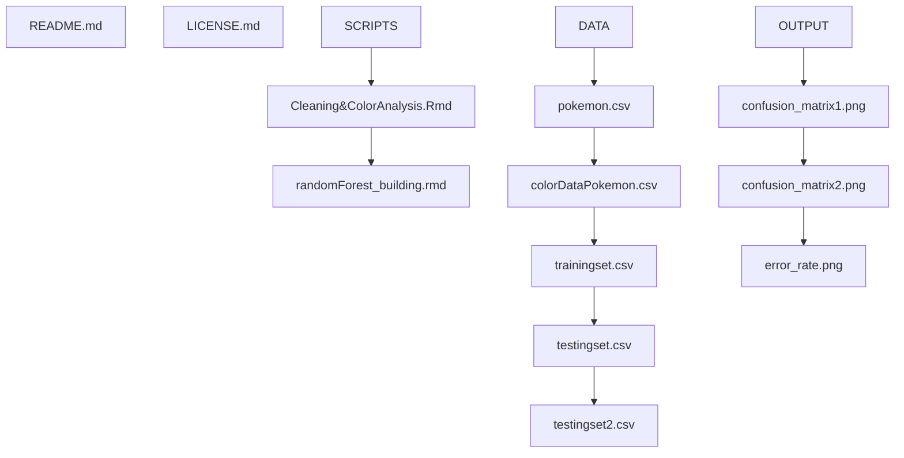

# DS4002 - CS3

Hook document 
Rubric
Various Materials (data, code, articles, etc.)
Elements from the MI3 rubric as appropriate

## Contents of Repository
This repository contains the code and documentation for replicating a study investigating whether it is possible to predict the primary types of different Pokemon based on the hex color codes found in their graphic images. This repository contains a README file, LICENSE file, MATERIALS folder, PROMPT/DELIVERABLES file, RUBRIC file. 

## Section 1: Hook and Rubric Documents
- Software Used: RStudio (R)
- Packages Used: tidyverse, randomForest, hues, colorfindr
- Platform used: Mac

## Section 2: Materials

- Outline or tree of hierarchy of folders and subfolders and list the files stored in each folder

## Section 3: References

